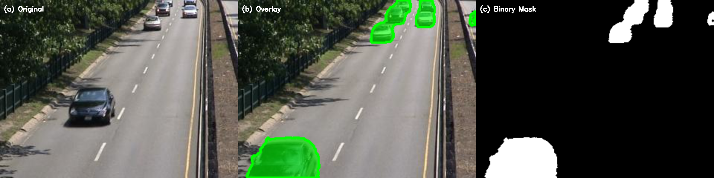
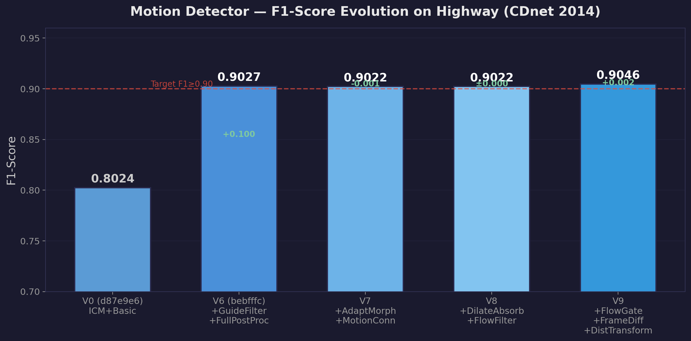
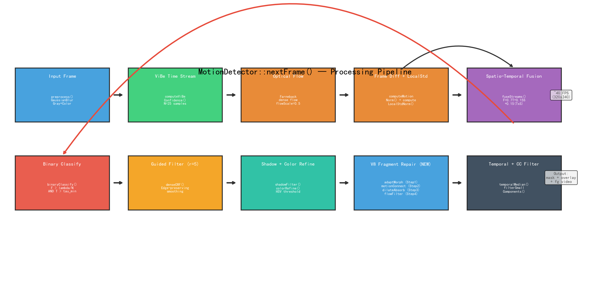
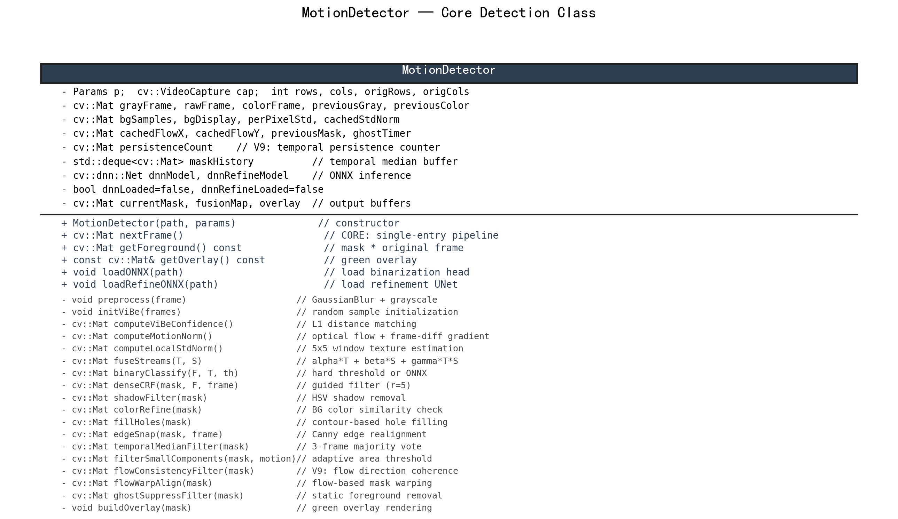

# Motion Detector — Video Moving Object Detection

> **C++ 实现 | 经典计算机视觉 | 无需训练 | 即插即用**

[]()
[]()
[]()
[]()

一个完整的视频运动目标检测系统，基于 ViBe 背景建模 + Farneback 稠密光流 + 引导滤波，在 CDnet 2014 highway 基准上达到 **F1 = 0.9046**。

---

## 效果展示

### Highway 检测样图

<p align="center">
  
  <br><em>从左至右：(a) 原始帧；(b) Overlay 叠加可视化（绿色=前景）；(c) 二值 Mask。Frame #676, Highway, CDnet 2014.</em>
</p>

### F1 迭代提升历程 (V0 → V9)

<p align="center">
  
</p>

| 版本 | Precision | Recall | **F1** | 关键改进 |
|------|:---:|:---:|:---:|------|
| V0 | 0.920 | 0.711 | 0.802 | ICM + Basic post-processing |
| V6 | 0.884 | 0.922 | 0.903 | Guided Filter + Full post-processing chain |
| V7 | 0.883 | 0.922 | 0.902 | Adaptive morphology + Motion connectivity |
| V8 | 0.883 | 0.923 | 0.902 | Dilation absorption + Flow filtering |
| **V9** | **0.882** | **0.929** | **0.905** | **Flow gate + Frame-diff + Distance transform** |

---

## 系统架构

<p align="center">
  
  <br><em>nextFrame() 核心处理流水线：从输入帧到输出 mask 的完整数据流</em>
</p>

### 核心算法

| 模块 | 算法 | 作用 |
|------|------|------|
| 背景建模 | **ViBe** | 每像素维护 25 个历史样本，L1 距离匹配 |
| 自适应 R | `R = vibeR + adaptRK × σ_local` | 纹理丰富处放宽，平坦处收紧 |
| 运动感知 | **Farneback 稠密光流** + 帧差梯度 | 空间流：锁定运动区域 + 运动边缘 |
| 时空融合 | `F = 0.7T + 0.15S + 0.15(T×S)` | 交叉项共识增强、单边打压 |
| 边缘精修 | **Guided Filter** (r=5, ε=12) | 保边平滑：`aₖ = cov(I,F)/(var(I)+ε)` |
| 后处理链 | 阴影过滤 → 碎片修复 → 空洞填充 → 时序滤波 → 连通域过滤 | 逐层精修 |
| 碎片修复 (V7/V8) | 自适应形态学核 + 运动矢量连通 + 膨胀吸附 + 光流过滤 | 人体四肢碎片连接 |
| 运动过滤 (V9) | 光流门控 + 帧差互补 + 距离变换 | 微颤过滤 + 漏检补偿 + 非闭合孔洞填充 |

### UML 类图

<p align="center">
  
</p>

**设计原则**：参数/算法分离（MotionDetectorParams + MotionDetector），对外仅暴露 `nextFrame()` 单一入口。

---

## 快速开始

### 环境依赖

- C++17 编译器 (MinGW-w64 / MSVC / GCC)
- CMake ≥ 3.16
- OpenCV ≥ 4.5 (含 opencv_contrib 的 ximgproc 模块)
- Qt6 (仅 GUI 版本需要)

### 编译 (命令行版本)

```bash
mkdir build && cd build
cmake .. -G "MinGW Makefiles"
make motion_detect
```

### 使用

```bash
# 处理视频文件
./motion_detect video.mp4

# 4K 视频快速处理 (缩放到 720p 内部计算, 输出仍为 4K)
./motion_detect video.mp4 --max-dim 720

# 批量评估 (图像序列 + ground truth)
./motion_detect "dataset/highway/input/in%06d.jpg" --batch --save-every 1

# 生成全部可视化输出
./motion_detect video.mp4 --max-dim 720 \
    --output-video mask.mp4 \
    --output-overlay overlay.mp4 \
    --output-fg foreground.mp4
```

### Qt6 GUI

```bash
cd cpp_training-src && mkdir build && cd build
cmake .. -G "MinGW Makefiles" -DCMAKE_PREFIX_PATH=<Qt6_path>
mingw32-make -j4
./MotionDetectorQt
```

---

## 命令行参数 (核心)

| 参数 | 默认值 | 说明 |
|------|:---:|------|
| `--init N` | 25 | ViBe 背景样本数 |
| `--vibe-r N` | 25 | ViBe 匹配半径 |
| `--lambda F` | 5.0 | 二值化阈值倍数 (θ = λ/N) |
| `--gf-radius N` | 5 | 引导滤波窗口半径 |
| `--gf-thresh F` | 0.35 | 引导滤波后二值化阈值 |
| `--flow-w F` | 0.6 | 光流在空间流中的权重 |
| `--min-area N` | 100 | 最小连通域面积 (px) |
| `--alpha F` | 0.7 | 时间流 (ViBe) 融合权重 |
| `--max-dim N` | 0 | 处理分辨率上限 (0=不缩放, 推荐 720) |
| `--flow-gate F` | 0.10 | V9: 光流幅值门控 |
| `--no-frame-diff` | — | V9: 关闭帧差互补 |
| `--no-dist-fill` | — | V9: 关闭距离变换空洞填充 |
| `--no-persistence` | — | V9: 关闭时序持续性过滤 |

---

## 目录结构

```
├── src/                          # CLI 核心源码
│   ├── motion_detector.h         # MotionDetectorParams + MotionDetector 类声明
│   ├── motion_detector.cpp       # 检测流水线实现 (~1300 行)
│   └── main.cpp                  # CLI 入口 + 参数解析
├── cpp_training-src/             # Qt6 GUI 源码
│   ├── main.cpp                  # Qt 入口
│   ├── mainwindow.{h,cpp}        # GUI 主窗口
│   ├── motion_detector.{h,cpp}   # 检测器 (同 CLI)
│   └── installer.nsi             # NSIS 安装包脚本
├── evaluate.py                   # 逐帧评估脚本 (P/R/F1/IoU + 7 张可视化图)
├── run_eval_batch.py             # 批量评估流水线
├── optuna_tune.py                # Optuna 贝叶斯参数自动调优
├── CMakeLists.txt                # CLI 构建配置
├── docs/images/                  # 文档图片
└── README.md
```

---

## 评估

```bash
# 运行检测器
./motion_detect "dataset/highway/input/in%06d.jpg" --batch --save-every 1 -o masks/

# 评估 (需 ground truth)
python evaluate.py masks/ dataset/highway/groundtruth/ \
    --temporal-roi 470 1700 --init 25 -o eval/

# 输出 7 张评估图:
# 01_per_frame_metrics.png  — 逐帧 Precision / Recall / F1 / IoU
# 02_metric_distributions.png — 指标分布直方图
# 03_tp_fp_fn_stack.png  — TP/FP/FN 堆叠面积图
# 04_confusion_matrix.png  — 混淆矩阵
# 05_iou_cdf.png  — IoU 累计分布函数
# 06_sample_frames.png  — 最佳/中位/最差帧可视化
# 07_random_frame_viz.png  — 随机帧 TP/FP/FN 彩色标注
```

---

## 参考文献

1. Barnich, O., & Van Droogenbroeck, M. (2011). ViBe: A universal background subtraction algorithm for video sequences. *IEEE TIP*.
2. He, K., Sun, J., & Tang, X. (2013). Guided image filtering. *IEEE TPAMI*.
3. Farneback, G. (2003). Two-frame motion estimation based on polynomial expansion. *SCIA*.
4. Wang, Y., et al. (2014). CDnet 2014: An expanded change detection benchmark dataset. *CVPR Workshops*.

---

## License

Educational project for Object-Oriented Programming Practice course.
